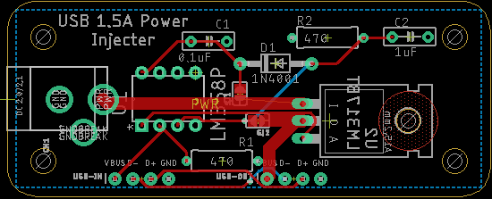
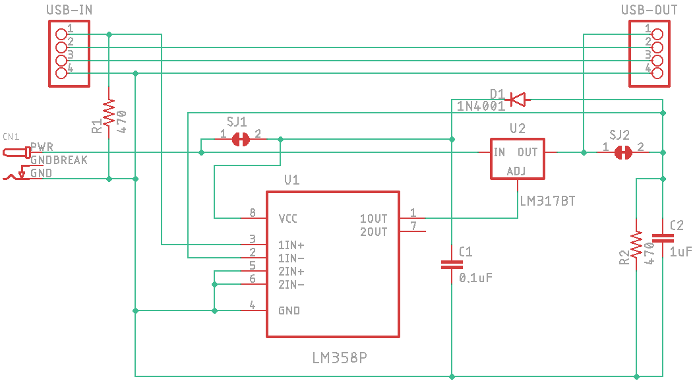

# The USB-PI Project

## Introduction

Welcome to the USB Power Injector project.

The purpose of this project is to boost a wimpy USB port's power output by inserting a high current voltage follower into the power path. The data lines will not be altered.

## Components

There are two USB-A terminated cables, one male, one female. Buy a short one, cut it in half, solder the leads to the board.

There's a socket for a 2.1x5.5mm coax power connector meant to accept a 7-9VDC voltage adapter.

The DC power from that is fed into a ST Micro LM318 1.5A adjustable [voltage  regulator](https://www.digikey.com/short/0mfnvtjf).

The Vbus power lead from the input USB cable is loaded with a 470Ω resistor and fed into the non-inverting terminal of a TI LM358 [opamp](https://www.digikey.com/short/zqhmd571). The Vbus power lead from the output USB cable is fed into the inverting terminal. The opamp's output is fed into the LM318's ADJ terminal.

The intent of the voltage follower is to maintain the Vbuss voltage rail for the data signals. It may not be necessary - I'll know soon enough.

## Other Thoughts

You'll see cut jumpers in the schematic and on the board. This is my current way of forcing Eagle to give me another net that I can put into a smaller net class. I don't really need 12mm tracks feeding an opamp input.

## Status

**Unbuilt and untested.** **Use at your own risk.** No warranty is implied. This is a DIY project. Things go wrong.

Tasks:

- [x] Order Parts
- [ ] Protoboard Test
- [ ] Order Boards
- [ ] Design & Print Enclosure
- [ ] Test Assembled Board(s)
- [ ] Docs & Instructions
- [ ] Assemble Kits

|    Date    | Notes                                                        |
| :--------: | ------------------------------------------------------------ |
| 2022-10-10 | I've ordered parts for (10) kits (just not all the cables) since I seem to be out of LM317s. I can use LT1084s for testing. |

 A parts list is below. The CSV [parts list file](board/USB-PI-DK-parts.csv) is in the board directory. 3-D printed enclosure files are pending.

## ToDo List

* Get LM317s and possibly add copper pads top and bottom with vias for heat dissipation.
* Maybe add a 10uF cap to the LM317s ADJ pin for ripple rejection.

## Schematic

---

## Parts List

|        Location        |        Value        | Pitch |  Drill   |                          Digi-Key #                          | Notes                                                  |
| :--------------------: | :-----------------: | :---: | :------: | :----------------------------------------------------------: | ------------------------------------------------------ |
|           U1           |       LM358P        | 9DIP  |    -     |   [296-1395-5-ND](https://www.digikey.com/short/cn50dbq5)    | Opamp                                                  |
|           U2           |       LM317BT       | TO220 |    -     |    [497-19621-ND](https://www.digikey.com/short/9fvhrfmm)    | LDO linear voltage regulator                           |
|           C1           |        0.1µF        | 0.2"  | 32.0 mil | [399-C322C104K5R5TA7303CT-ND](https://www.digikey.com/short/w4d7qbqn) | 50V X7R ceramic                                        |
|           C2           |        1.0µF        | 0.2"  | 32.0 mil |   [399-13938-1-ND](https://www.digikey.com/short/w4hqd3b3)   | 50V X7R ceramic                                        |
|           D1           |       1N4001        | 0.4"  | 44.0 mil | [1N4001-E3/73GICT-ND](https://www.digikey.com/short/9t2nj8h2) | 50V 1A                                                 |
|         R1 R2          |        470Ω         | 0.4"  | 32.0 mil |     [S470HCT-ND](https://www.digikey.com/short/qfv9j77w)     | 1/2W 5%                                                |
|    Power Connector     | 2.1mm ID x 5.5mm OD |   -   |    -     |     [CP-002A-ND](https://www.digikey.com/short/zqmbpp04)     | **Unverified footprint**                               |
|   USB Header In/Out    |         1x4         | 0.1"  | 39.4 mil |   [S1211EC-08-ND](https://www.digikey.com/short/m4cnmnhh)    | 1x8 break-away .032" contact 3A gold **OPTIONAL**      |
|         Cable          |      UR024-001      |   -   |    -     |      [TL502-ND](https://www.digikey.com/short/z9fq5374)      | Tripp Lite 1' 24AWG power (**see alternatives below**) |
|  Male cable w/ header  |                     |       |          |       [Amazon](https://smile.amazon.com/dp/B06Y5RKMT8)       | USB-A male to 5-pin DuPont (x2)                        |
| Female cable w/ header |                     |       |          |       [Amazon](https://smile.amazon.com/dp/B06Y5KZC9W)       | USB-A female to 5-pin DuPont header                    |
|       DC Adapter       |                     |       |          |      [D-K Sort](https://www.digikey.com/short/7ft35n9b)      | 7.5VDC 2.0A preferred (*)                              |

A CSV file has been provided that can be imported into a Digi-Key List or Cart.

The header is optional and will cut or snap into the two pieces you can use for DuPont connectors.

\* Lower voltage (but >6VDC) is preferred to reduce regulator heat output. More current capability is okay, it's just more expensive usually. The search is sorted by voltage, not by price.