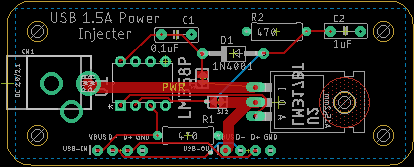

# The USB-PI Project

## Introduction

Welcome to the USB Power Injector project.

The purpose of this project is to boost a wimpy USB port's power output by inserting a high current voltage follower into the power path. The data lines will not be altered.

## Components

There are two USB-A terminated cables, one male, one female. Buy a short one, cut it in half, solder the leads to the board.

There's a socket for a 2.1x5.5mm coax power connector meant to accept a 7-9VDC voltage adapter.

The DC power from that is fed into a ST Micro LM318 1.5A adjustable [voltage  regulator](https://www.digikey.com/short/0mfnvtjf).

The Vbus power lead from the input USB cable is loaded with a 470Ω resistor and fed into the non-inverting terminal of a TI LM358 [opamp](https://www.digikey.com/short/zqhmd571). The Vbus power lead from the output USB cable is fed into the inverting terminal. The opamp's output is fed into the LM318's ADJ terminal.

The intent of the voltage follower is to maintain the Vbuss voltage rail for the data signals. It may not be necessary - I'll know soon enough.

## Other Thoughts

You'll see cut jumpers in the schematic and on the board. This is my current way of forcing Eagle to give me another net that I can put into a smaller net class. I don't really need 12mm tracks feeding an opamp input.

## Status

Unbuild and untested.

A parts list is pending, plus a 3-D printed enclosure.

I'll probably shuffle things around a bit to get the power connector closer to the voltage regulator, and have it pointed toward one of the ends so it won't be so awkward.

...

## Schematic and Board Images:

